# Phison Continue User Guide

## Overview

Welcome to the Phison Continue User Guide! This comprehensive guide will walk you through the installation, setup, and usage of Phison's customized Continue extension for Visual Studio Code.

Phison Continue is an AI-powered coding assistant that leverages the innovative **aiDAPTIV+ kvcache** technology to provide lightning-fast responses to your code-related questions. By building a knowledge cache of your project, it enables near-instantaneous answers and significantly enhances your development experience.

This guide covers:

- Installation and setup procedures
- How to use the extension with demo examples
- Troubleshooting common issues

Let's get started!

---

## Chapter 1: Installation and Setup

### 1.1 Install Visual Studio Code

First, you need to install Visual Studio Code on your Windows machine.

**Download Link:** [https://code.visualstudio.com/download](https://code.visualstudio.com/download)

**Steps:**

1. Visit the download link above
2. Select the **Windows** version
3. Download the installer
4. Run the installer and follow the installation wizard
5. Launch Visual Studio Code after installation completes

### 1.2 Download Phison Continue Extension and Demo Example

You'll need to obtain two essential components from the `aiDAPTIV_Files` directory:

**a. Phison Continue Extension**

- Location: `aiDAPTIV_Files\Installer`
- File: `continue-1.2.9.vsix`

**b. Demo Example Files**

- Location: `aiDAPTIV_Files\ExampleFiles`
- Contents:
  - `greedy_snake` folder (demo project)
  - `golden_QA.txt` (sample questions for testing)
  - `start_greedy_snake.bat` (quick start script)

### 1.3 Install Phison Continue Extension in VS Code

Once you have downloaded the extension file, follow these steps to install it:

**Steps:**

1. Open Visual Studio Code
2. Click on the **Extensions** icon in the left sidebar (or press `Ctrl+Shift+X`)
3. Click on the **"..."** (three dots) menu at the top of the Extensions panel
4. Select **"Install from VSIX..."**
   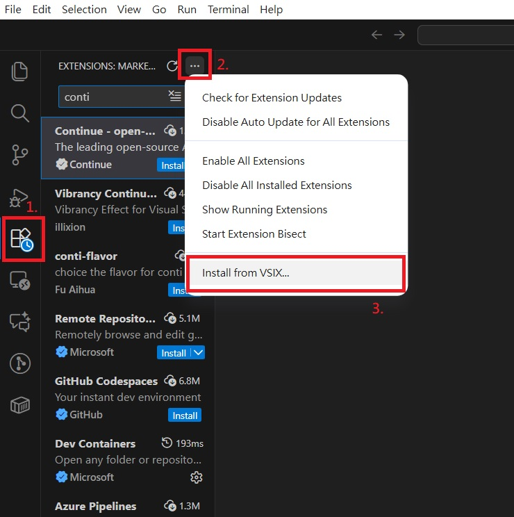

5. Navigate to `aiDAPTIV_Files\Installer` and select `continue-1.2.9.vsix`
6. Click **Install**
   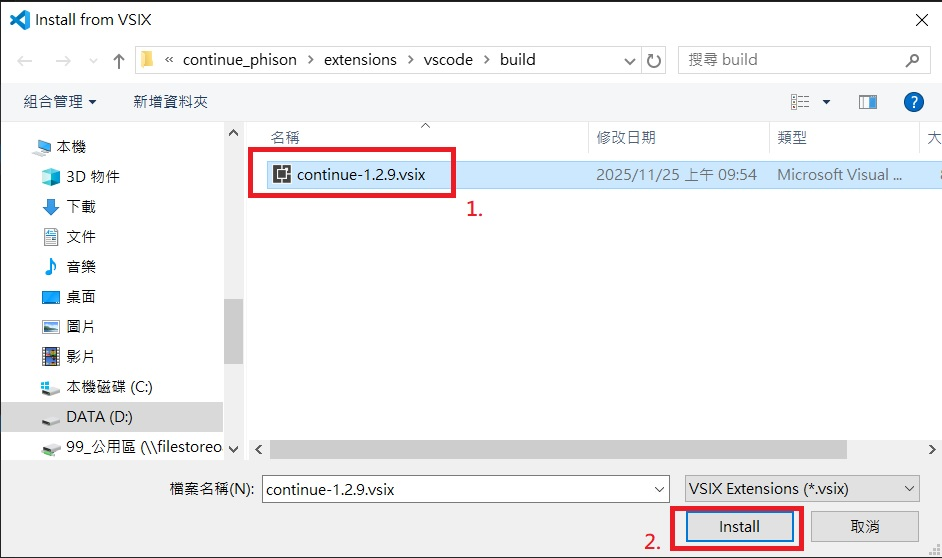
7. Wait for the installation to complete
8. You should see the Continue icon appear in the left sidebar

**Congratulations!** You have successfully installed the Phison Continue extension.

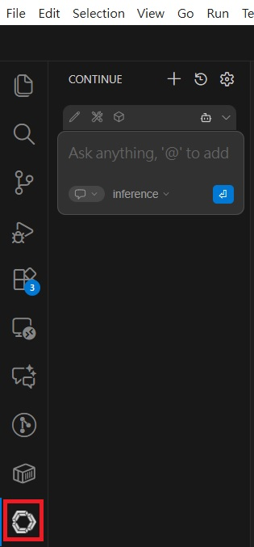

---

## Chapter 2: How to Use?

### 2.1 Open the Demo Example Project

Before you can start using the AI assistant, you need to open the demo project correctly.

**Important Note:** ⚠️ The demo example project **must** be placed inside a parent folder. For example: `phison_coder/greedy_snake`

**Steps:**

1. Create a parent folder (e.g., `phison_coder`)
2. Copy the `greedy_snake` folder from `aiDAPTIV_Files\ExampleFiles` into your parent folder
   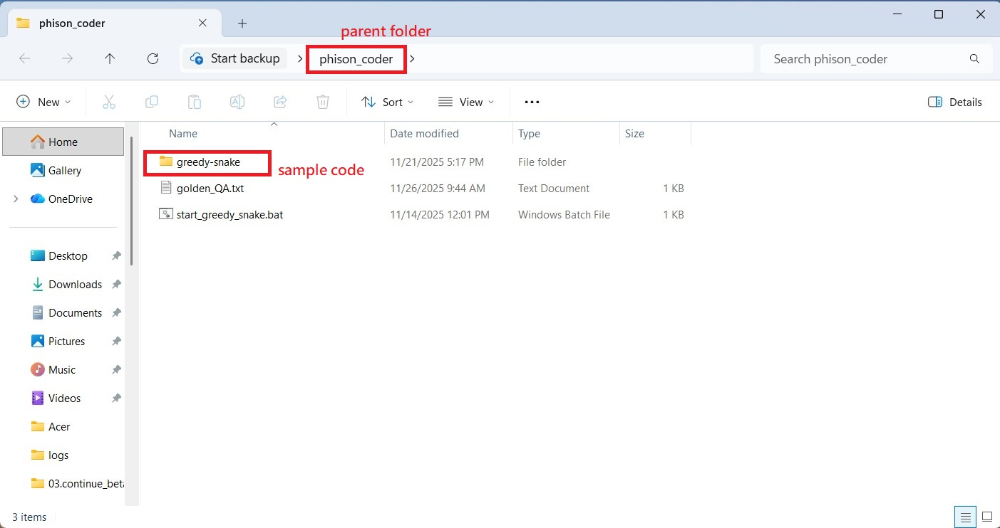
3. In VS Code, go to **File** → **Open Folder**
4. Navigate to and select the parent folder (e.g., `phison_coder`)
5. Click **Select Folder**
   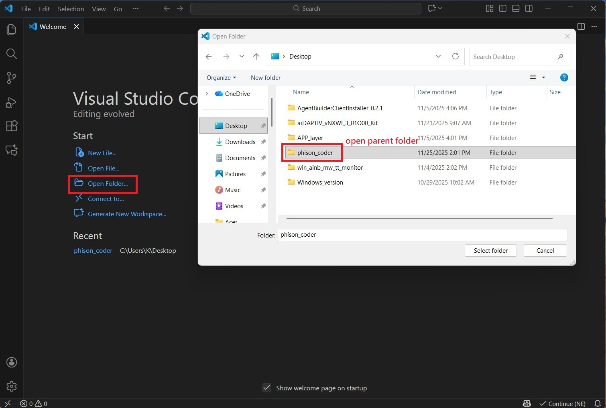

Your project structure should look like this:

```
phison_coder/
└── greedy_snake/
    ├── app.py
    ├── index.html
    ├── config.js
    ├── requirements.txt
    └── ...
```

### 2.2 Build Project kvcache

If this is the first time opening this project, please build the kvcache first.

**Steps:**

**a. Navigate to aiDAPTIV+ Settings**

1. Click on the **Continue** icon in the left sidebar
2. Click on the **Settings** (gear icon) button
   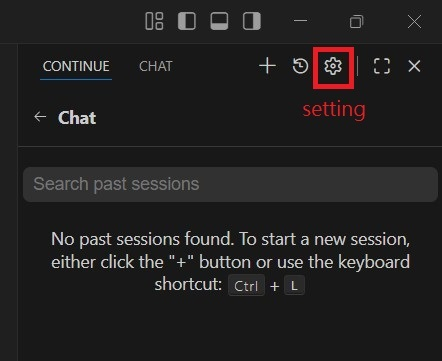
3. Find and click on **aiDAPTIV+ kvcache** section
4. Click the **Build** button
   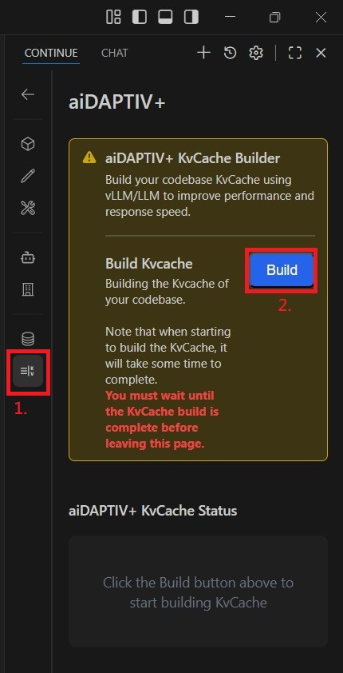

**b. Monitor the Build Progress**

- A **progress bar** will appear at the bottom of the settings page
- The progress bar shows the current execution status
- The build process analyzes your project files and creates an optimized cache
  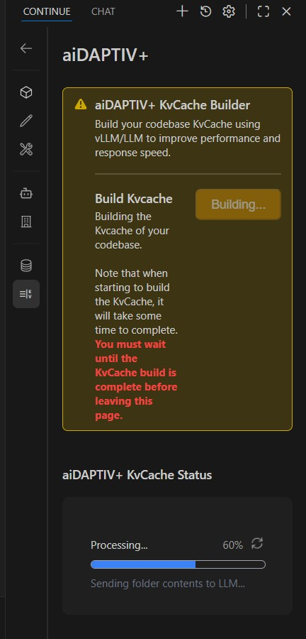
  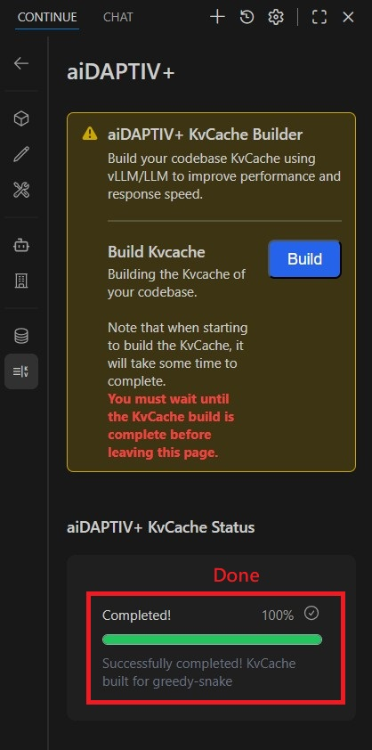

**c. Important Warning** ⚠️

- **You MUST wait until the build process is completely finished**
- **Do NOT leave or close this page** until the progress bar reaches 100%
- Interrupting the build process may result in an incomplete cache and degraded performance

**Build Time:** The build time varies depending on your project size. For the demo project, it typically takes 1-3 minutes.

### 2.3 Ask Questions About Your Project

Once the kvcache build is complete, you're ready to experience the power of Phison aiDAPTIV+!

**Steps:**

**a. Use the Chat Window**

- Navigate to the **Continue** chat panel, and select the example code folder
  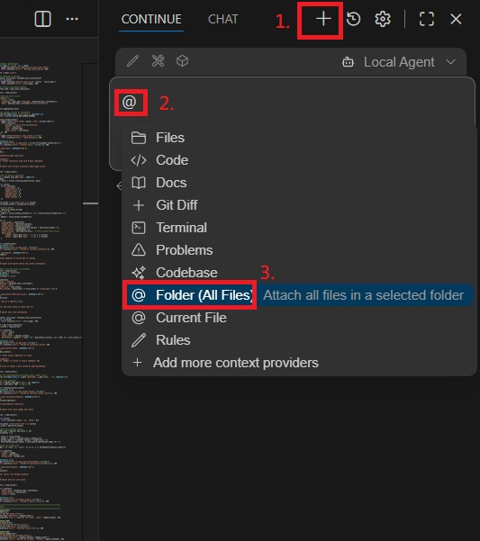
  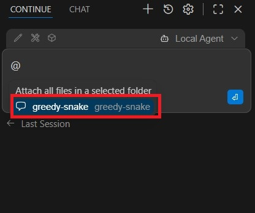

- In the input box, type your question using the following format:

  ```
  @{folder} + your question
  ```

  For example:

  ```
  @greedy_snake briefly explain where can i change the game speed? it's too fast
  ```

  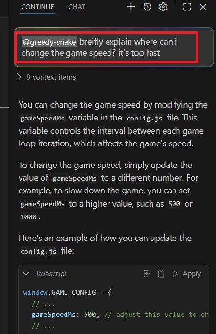

**b. Try the Golden Questions**

For your **first question**, we highly recommend using one of the questions from the `golden_QA.txt` file to experience the incredible speed of Phison aiDAPTIV+:

**Question 1:**

```
@greedy_snake briefly explain where can i change the game speed? it's too fast
```

**Question 2:**

```
@greedy_snake briefly explain where can i set the background? i don't like the current color
```

**Question 3:**

```
@greedy_snake where can i set the title Emoji? I have my own Emoji
```

**c. Submit and Wait for Response**

1. Press the **Enter** button
2. Wait for the AI to process your question
3. The response will appear in the chat window


### 2.4 Tips for Effective Usage

- **Always use `@{folder}`** to ensure the AI has proper context
- **Be specific** in your questions for better answers
- **Ask about code structure**, functionality, configuration, or best practices
- **Follow up** with additional questions to dive deeper into topics

---

## Chapter 3: Troubleshooting (Optional)

This section covers common issues you might encounter and their solutions.

### 3.1 Extension Installation Issues

**Problem:** Cannot install the VSIX file

**Solutions:**

- Ensure you're using a compatible version of VS Code (version 1.70 or higher recommended)
- Check that the VSIX file is not corrupted (file size should be reasonable)
- Try restarting VS Code and attempting installation again
- Run VS Code as Administrator if you encounter permission issues

### 3.2 kvcache Build Issues

**Problem:** kvcache build fails - connection error

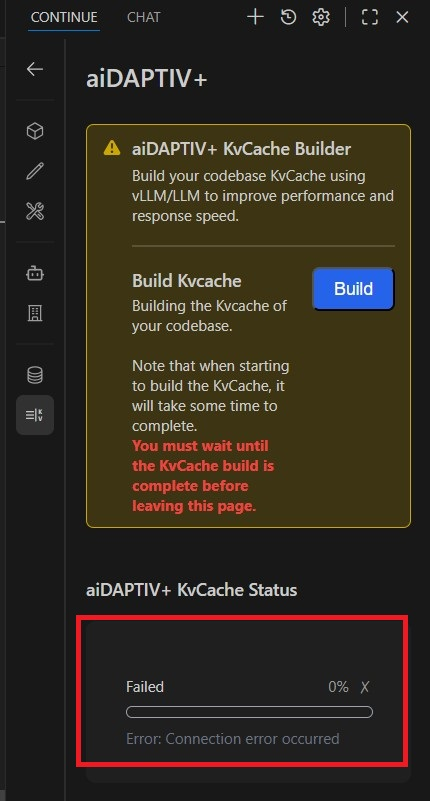

**Solutions:**

- Ensure the Phison llama.cpp server is working

**Problem:** kvcache build fails or gets stuck

**Solutions:**

- Ensure your project folder structure is correct (project must be in a parent folder)
- Check that you have sufficient disk space
- Verify that no files in the project are locked by other applications
- Try closing and reopening the project folder
- Restart VS Code and attempt the build again

---

## Conclusion

Thank you for using Phison Continue! We hope this guide helps you get started quickly and make the most of the aiDAPTIV+ technology. The combination of AI assistance and optimized kvcache technology is designed to dramatically accelerate your development workflow.

**Key Takeaways:**

- ✅ Install VS Code and the Phison Continue extension
- ✅ Place your project in a parent folder structure
- ✅ Build the kvcache before asking questions
- ✅ Use `@{folder}` syntax for context-aware queries
- ✅ Experience lightning-fast AI responses

Happy coding! 🚀
